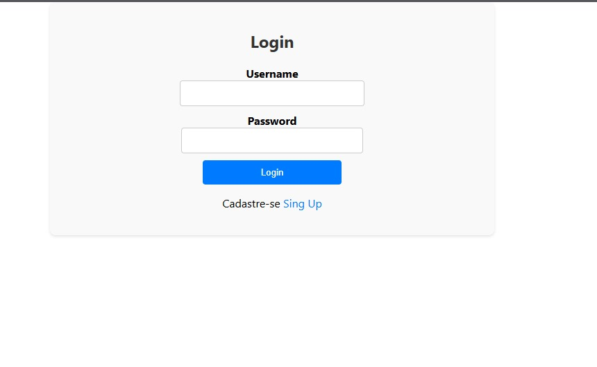
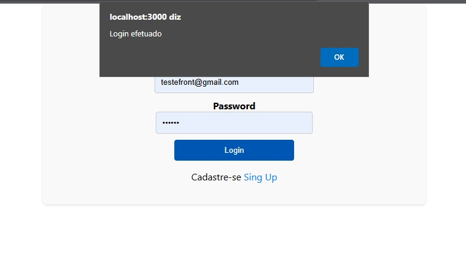
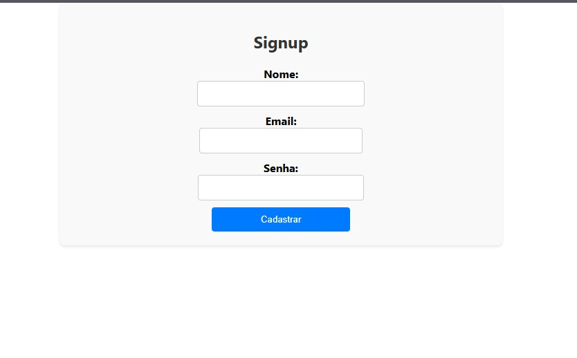
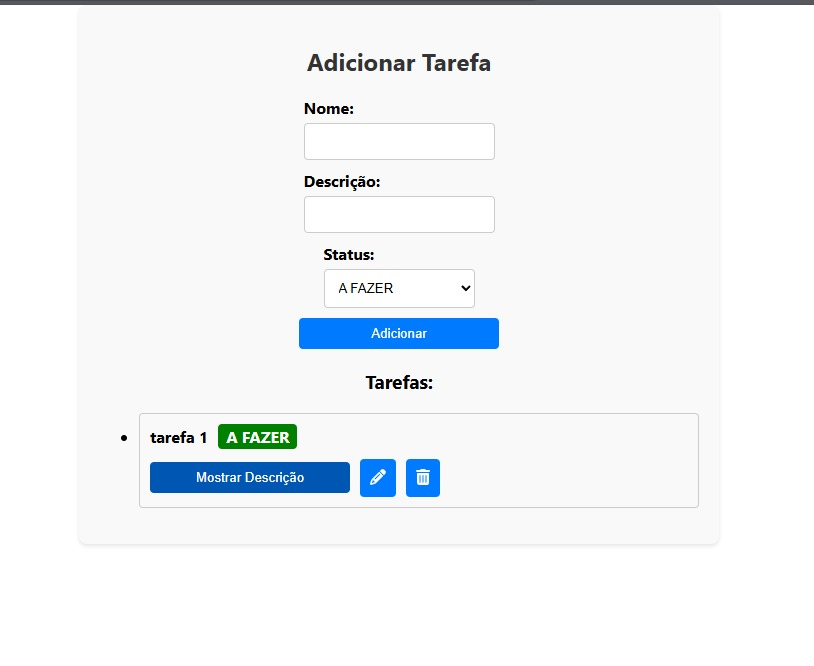
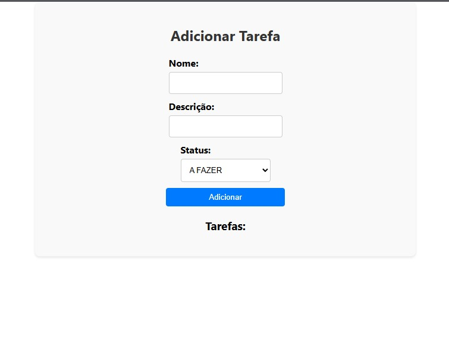
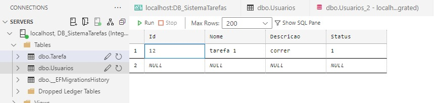
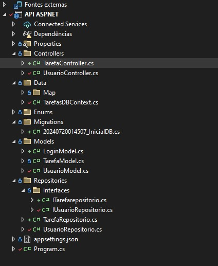
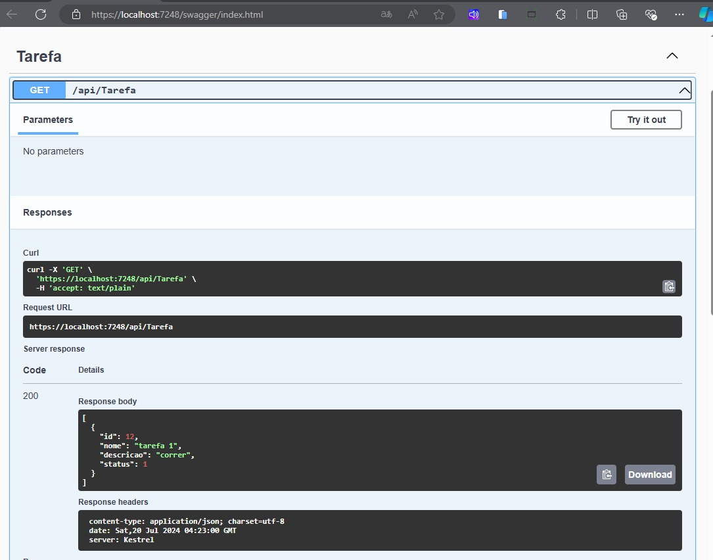

# Descrição
Este projeto é uma aplicação para gerenciamento de tarefas. 

É composto por um frontend em React.js e um backend em ASP.NET Core.

## Funcionalidades
- Criar usuario
- Login
- Criar Tarefas
- Editar
- Listar
- Excluir

## Estrutura do Projeto

Frontend: Aplicação React.js para interação com o usuário.

Backend: API ASP.NET Core que gerencia as tarefas e se comunica com o banco de dados.

## Executar

### Frontend
- Use o comando `npm install` para instalar as dependências.
- Use o comando `npm run start` para rodar a interface.

### Backend
- Ambiente para C#, visual studio code
- Use o comando `dotnet run` para rodas backend.

### Especificações
- Banco de dados foi usado o já integrado com visual studio, SQLServer.

## Imagens 

